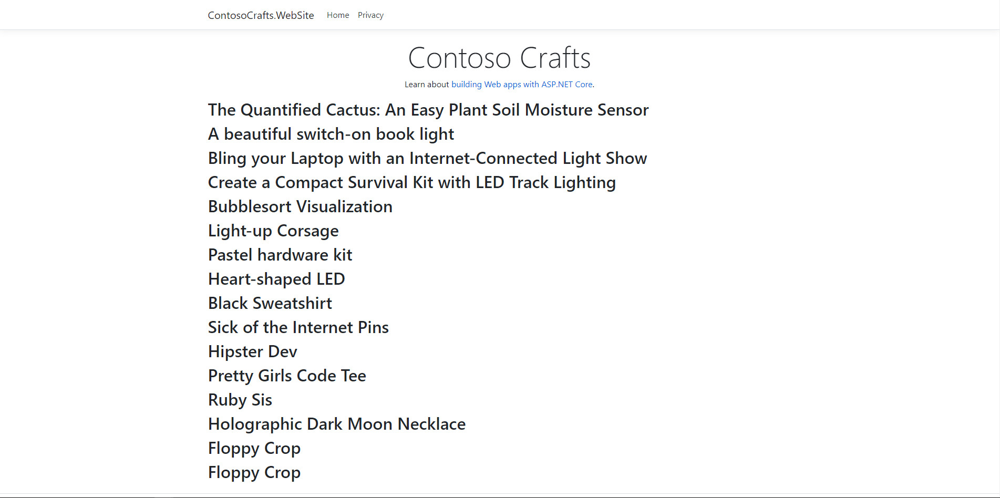
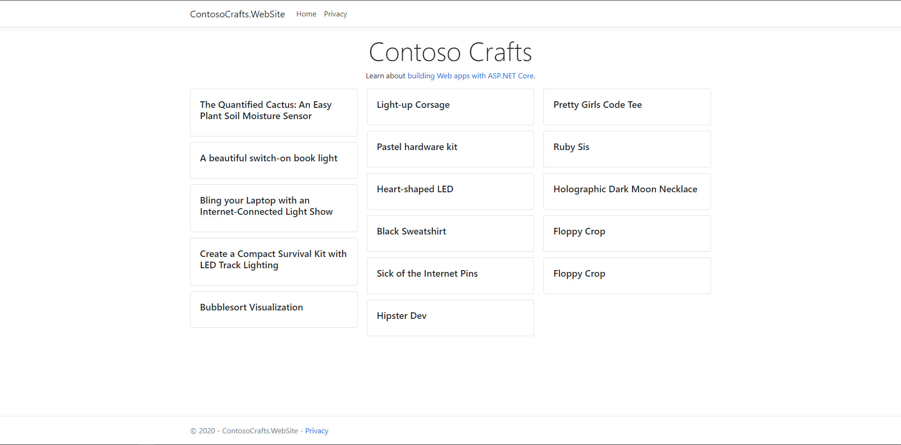
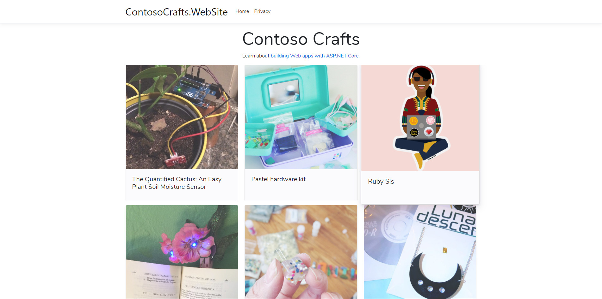
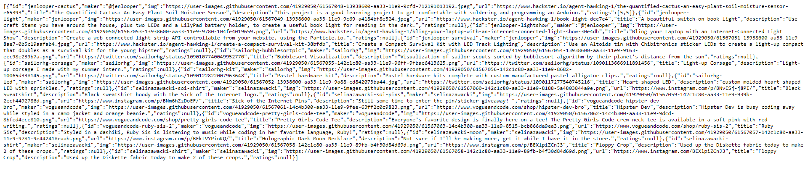
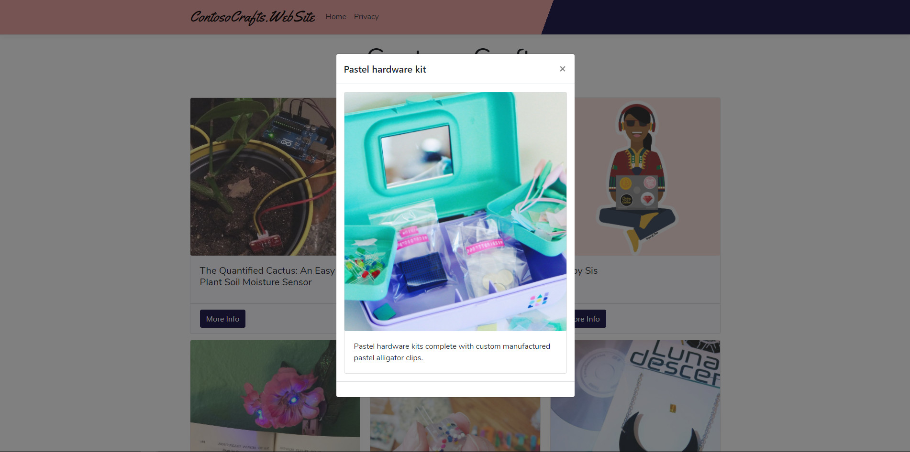
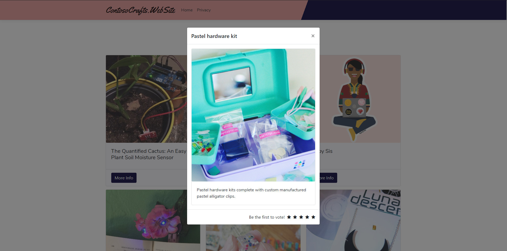

# ContosoCrafts
- Create project ASP.NET MVC Core

***[Adding Data](https://www.youtube.com/watch?v=JfnTG955cuk&list=PLdo4fOcmZ0oW8nviYduHq7bmKode-p8Wy&index=3)***

Now that we have an ASP.NET website that has Razor Pages, let's add some data dynamically!
- Add data folder `wwwroot` ==> `product.json` ([Download](https://github.com/dotnet-presentations/ContosoCrafts/blob/master/src/wwwroot/data/products.json))
- Add `Models` folder ==> `Product.cs` with the following code:
```
    public class Product
    {
        public string Id { get; set; }
        public string Maker { get; set; }

        [JsonPropertyName("img")]
        public string Image { get; set; }
        public string Url { get; set; }
        public string Title { get; set; }
        public string Description { get; set; }
        public int[] Ratings { get; set; }

        public override string ToString() => JsonSerializer.Serialize<Product>(this);
    }
```
***[Adding a Service](https://www.youtube.com/watch?v=JfnTG955cuk&list=PLdo4fOcmZ0oW8nviYduHq7bmKode-p8Wy&index=4)***

ASP.NET uses a technique called "dependency injection" that's built right in. That lets us make classes called "services" that we can make available to any other classes in our website. Let's add a service now!

- Add Services folder ==> `JsonFileProductService.cs` with the following code:
```
    public class JsonFileProductService
    {
        public JsonFileProductService(IWebHostEnvironment webHostEnvironment)
        {
            WebHostEnvironment = webHostEnvironment;
        }

        public IWebHostEnvironment WebHostEnvironment { get; }

        private string JsonFileName
        {
            get { return Path.Combine(WebHostEnvironment.WebRootPath, "data", "products.json"); }
        }

        public IEnumerable<Product> GetProducts()
        {
            using(var jsonFileReader = File.OpenText(JsonFileName))
            {
                return JsonSerializer.Deserialize<Product[]>(jsonFileReader.ReadToEnd(),
                    new JsonSerializerOptions
                    {
                        PropertyNameCaseInsensitive = true
                    });
            }
        }
    }
```
- Edit `Startup.cs` ==> `ConfigureServices`
```
    services.AddTransient<JsonFileProductService>();
``` 
***[Data in a Razor Page](https://www.youtube.com/watch?v=aP02__gMLtw&list=PLdo4fOcmZ0oW8nviYduHq7bmKode-p8Wy&index=5)***

We've got some data and a service to manage it, now we'll foreach over our database's data and output the result in our ASP.NET website's razor page!

- Edit `Index.cshtml.cs` with the following code:
```
    public IndexModel (ILogger<IndexModel> logger, JsonFileProductService productService)
    { 
        ProductService = productService;
        _logger = logger;
    }

    public JsonFileProductService ProductService { get; } 
    public IEnumerable<Product> Products { get; private set; }

    public void OnGet() 
    {
        Products = ProductService.GetProducts();
    }
```
- Edit Index.cshtml to display titles:
```
    @foreach (var product in Model.Products) 
    {
        <h2>@product.Title</h2>
    }
```


***[Styling a Razor Page](https://www.youtube.com/watch?v=9lJF47kFRcU&list=PLdo4fOcmZ0oW8nviYduHq7bmKode-p8Wy&index=6)***

Make it work, then make it pretty! Let's add some CSS to our Bootstrap template that will take our ASP.NET Core website to the next level.

- Edit Index.cshtml to display images and titles:
```
<div class="card-columns">
    @foreach (var product in ProductService.GetProducts())
    {
        <div class="card">
            <div class="card-img" style="background-image: url('@product.Image');"></div>
            <div class="card-body">
                <h5 class="card-title">@product.Title</h5>
            </div>
        </div>
    }
</div>
```


If it don't display images, you could try update file site.css with the following code ([Download](https://www.youtube.com/redirect?v=9lJF47kFRcU&redir_token=QUFFLUhqbGlkUmV5emowSlhZR0s3UjhGa2w4cmZ4THdCZ3xBQ3Jtc0tuV05YcnJ6andqdk41NVF0cy1RaEpVRnl0SmNVcjFBRUNTb1JGTFRtRkJLOXN2MnBLUHl2V3R6cjQ2M0FhR0Z4NVVQZ19VbjBXNWlEbG1ERHc1ZkhOM3lLVVZpLURwRURyZTlma0VOTUVrdFRkemVXVQ%3D%3D&event=video_description&q=https%3A%2F%2Fgist.github.com%2Fbradygaster%2F3d1fcf43d1d1e73ea5d6c1b5aab40130%23file-site-css))

- Add font style `Yellowtail` and `Nunito` in file `_Layout.cshtml` with the following code:
```
    <link href="https://fonts.googleapis.com/css?family=Yellowtail&display=swap" rel="stylesheet">
    <link href="https://fonts.googleapis.com/css?family=Nunito&display=swap" rel="stylesheet">
```
- At the same time change background `br-white` -> `br-navbar` in line 14
```
<nav class="navbar navbar-expand-sm navbar-toggleable-sm navbar-light bg-navbar border-bottom box-shadow mb-3">
```


***[Making a Simple API](https://www.youtube.com/watch?v=04IP3Yl8-64&list=PLdo4fOcmZ0oW8nviYduHq7bmKode-p8Wy&index=7)***

We might want our application's data to be available to a mobile app in the future. Lots of web applications output HTML for people to see in their browser, and the best web apps also include a JSON API that allows others consume the data from JavaScript or any other language.

- Let's try creating a simple API with `MapGet()` in `app.UseEndpoints()`:
```
    endpoints.MapGet("/products", (context) =>
    {
        var products = app.ApplicationServices.GetService<JsonFileProductService>().GetProducts();
        var json = JsonSerializer.Serialize<IEnumerable<Product>>(products);
        return context.Response.WriteAsync(json);
    });
```
You can test the api is working or not working by running url: `https://localhost:<port>/products`



***[Enhancing Web API](https://www.youtube.com/watch?v=04IP3Yl8-64&list=PLdo4fOcmZ0oW8nviYduHq7bmKode-p8Wy&index=8)***

- Create `ProductsController.cs` in folder `Controllers` with format `API Controller - Empty`.
- Add content with the following code:
```
    namespace ContosoCrafts.WebSite.Controllers
    {
        [Route("api/[controller]")]
        [ApiController]
        public class ProductsController : ControllerBase
        {
            public ProductsController(JsonFileProductService productService)
            {
                ProductService = productService;
            }
    
            public JsonFileProductService ProductService { get; }
    
            [HttpGet]
            public IEnumerable<Product> Get()
            {
                return ProductService.GetProducts();
            }
        }
    }
```
- Edit `Startup.cs` 
```
    public void ConfigureServices(IServiceCollection services)
    {
        services.AddRazorPages();
        services.AddControllers();
        services.AddTransient<JsonFileProductService>();
    }
 
    ...

    app.UseEndpoints(endpoints =>
    {
        endpoints.MapRazorPages();
        endpoints.MapControllers();
    });
``` 

Before we got data from the json file, now let's try to do the reverse to put the data in the json file

- Add service ratting

    - First, add function `AddRating()` in the file `JsonFileProductService.cs` with the following code:
    ```
    public void AddRating(string productId, int rating)
    {
        var products = GetProducts();

        var query = products.First(x => x.Id == productId);

        if (query.Ratings == null)
        {
            query.Ratings = new int[] { rating };
        }
        else
        {
            var ratings = query.Ratings.ToList();
            ratings.Add(rating);
            query.Ratings = ratings.ToArray();
        }

        using (var outputStream = File.OpenWrite(JsonFileName))
        {
            JsonSerializer.Serialize<IEnumerable<Product>>(
                new Utf8JsonWriter(outputStream, new JsonWriterOptions
                {
                    SkipValidation = true,
                    Indented = true
                }),
                products
            );
        }
    }
    ```
    - Second, add controller in `ProductController.cs` with the following code:
    ```
    [Route("Rate")]
    [HttpGet]
    public ActionResult Get(
        [FromQuery] string ProductId, 
        [FromQuery] int Rating)
    {
        ProductService.AddRating(ProductId, Rating);
        return Ok();
    }
    ```
    - Third, you can test by url: `https://localhost:<port>/products/rate?ProductId=<id>$rating=<int>`
    next check file `product.json`

***[Razor Components](https://www.youtube.com/watch?v=R23v4lgHYQI&list=PLdo4fOcmZ0oW8nviYduHq7bmKode-p8Wy&index=10)***

- Create folder `Component` 
- In folder `Component` create file `Razor Component` with name `ProductList.razor`
- Instead of using in `Index.cshtml`:
```
    <div class="card-columns">
        @foreach (var product in ProductService.GetProducts())
        {
            <div class="card">
                <div class="card-img" style="background-image: url('@product.Image');"></div>
                <div class="card-body">
                    <h5 class="card-title">@product.Title</h5>
                </div>
            </div>
        }
    </div>
```
- We will use file `ProductList.razor` with the following code:
```
    @using ContosoCrafts.WebSite.Models
    @using ContosoCrafts.WebSite.Services
    @using Microsoft.AspNetCore.Components.Web
    @inject JsonFileProductService ProductService
    
    <div class="card-columns">
        @foreach (var product in ProductService.GetProducts())
        {
            <div class="card">
                <div class="card-img" style="background-image: url('@product.Image');"></div>
                <div class="card-body">
                    <h5 class="card-title">@product.Title</h5>
                </div>
                <div class="card-footer">
                    <small class="text-muted">
                        <button @onclick="(e => SelectProduct(product.Id))"
                                data-toggle="modal" data-target="#productModal" class="btn btn-primary">
                            More Info
                        </button>
                    </small>
                </div>
            </div>
        }
    </div>
    
    @code 
    {
        Product selectedProduct;
        string selectedProductId;
    
        void SelectProduct(string productId)
        {
            selectedProductId = productId;
            selectedProduct = ProductService.GetProducts().First(x => x.Id == productId);
            GetCurrentRating();
        }
    }
```
- Next, edit `Startup.cs`:
```
    public void ConfigureServices(IServiceCollection services)
    {
        services.AddRazorPages();
        services.AddServerSideBlazor();
        services.AddControllers();
        services.AddTransient<JsonFileProductService>();
    }
....
    app.UseEndpoints(endpoints =>
    {
        endpoints.MapRazorPages();
        endpoints.MapControllers();
        endpoints.MapBlazorHub();
    });
```
- Add script and mapping file `ProductList.razor` in file `Index.cshtml`:
```
    @page
    @using ContosoCrafts.WebSite.Components
    @model IndexModel
    @{
        ViewData["Title"] = "Home page";
    }
    
    <div class="text-center">
        <h1 class="display-4">Contoso Crafts</h1>
        <p>Learn about <a href="https://docs.microsoft.com/aspnet/core">building Web apps with ASP.NET Core</a>.</p>
    </div>
    
    @(await Html.RenderComponentAsync<ProductList>(RenderMode.ServerPrerendered))
    
    <script src="_framework/blazor.server.js"></script>
```

***[Structure](https://www.youtube.com/watch?v=wA-3FA2kbpA&list=PLdo4fOcmZ0oW8nviYduHq7bmKode-p8Wy&index=11)***

- Add popup detail when click button `More info`:
```
    @if (selectedProduct != null)
    {
        <div class="modal fade" id="productModal" tabindex="-1" role="dialog" aria-labelledby="productTitle" aria-hidden="true">
            <div class="modal-dialog modal-dialog-centered" role="document">
                <div class="modal-content">
                    <div class="modal-header">
                        <h5 class="modal-title" id="productTitle">@selectedProduct.Title</h5>
                        <button type="button" class="close" data-dismiss="modal" aria-label="Close">
                            <span aria-hidden="true">&times;</span>
                        </button>
                    </div>
                    <div class="modal-body">
                        <div class="card">
                            <div class="card-img" style="background-image: url('@selectedProduct.Image');">
                            </div>
                            <div class="card-body">
                                <p class="card-text">@selectedProduct.Description</p>
                            </div>
                        </div>
                    </div>
                    <div class="modal-footer">
                        
                    </div>
                </div>
            </div>
        </div>
    }
```



***[Interactivity](https://www.youtube.com/watch?v=IhoDDZBW6dc&list=PLdo4fOcmZ0oW8nviYduHq7bmKode-p8Wy&index=12)***

- Add ..... in `ProductList.cs`:
```
    @code
    {
        Product selectedProduct;
        string selectedProductId;
    
        void SelectProduct(string productId)
        {
            selectedProductId = productId;
            selectedProduct = ProductService.GetProducts().First(x => x.Id == productId);
            GetCurrentRating();
        }
    
        int currentRating = 0;
        int voteCount = 0;
        string voteLabel;
    
        void GetCurrentRating()
        {
            if (selectedProduct.Ratings == null)
            {
                currentRating = 0;
                voteCount = 0;
            }
            else
            {
                voteCount = selectedProduct.Ratings.Count();
                voteLabel = voteCount > 1 ? "Votes" : "Vote";
                currentRating = selectedProduct.Ratings.Sum() / voteCount;
            }
    
            System.Console.WriteLine($"Current rating for {selectedProduct.Id}: {currentRating}");
        }
    
        void SubmitRating(int rating)
        {
            System.Console.WriteLine($"Rating received for {selectedProduct.Id}: {rating}");
            ProductService.AddRating(selectedProductId, rating);
            SelectProduct(selectedProductId);
        }
    }
```
and 
```
    <div class="modal-footer">
        @if (voteCount == 0)
        {
            <span>Be the first to vote!</span>
        }
        else
        {
            <span>@voteCount @voteLabel</span>
        }
        @for (int i = 1; i < 6; i++)
        {
            var currentStar = i;
            if (i <= currentRating)
            {
                <span class="fa fa-star checked" @onclick="(e => SubmitRating(currentStar))"></span>
            }
            else
            {
                <span class="fa fa-star" @onclick="(e => SubmitRating(currentStar))"></span>
            }
        }
    </div>

    .......

    <link rel="stylesheet" href="https://cdnjs.cloudflare.com/ajax/libs/font-awesome/4.7.0/css/font-awesome.min.css">

```


